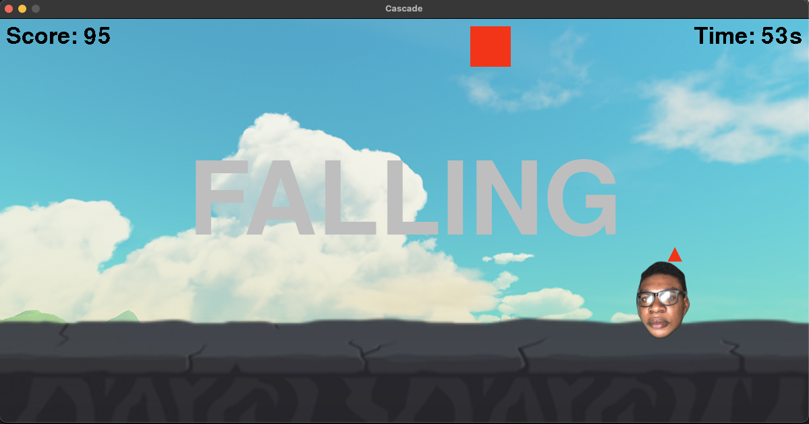
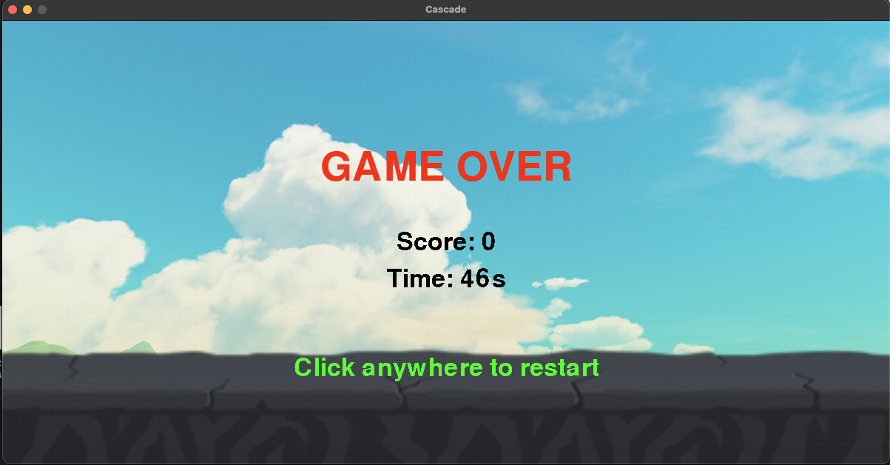

# 🎮 Cascade

Cascade is a fast-paced arcade game built with **Python** and **Pygame**, where players react quickly to falling elements on the screen. It combines smooth animations, dynamic scoring, and minimal design to create an addictive, replayable experience.

---

## 🚀 Features

- ⚡ **Fast-paced gameplay** – React quickly to catch or avoid falling objects.  
- 🎨 **Clean visuals** – Simple yet immersive UI for a distraction-free experience.  
- 💯 **Score tracking** – Keeps count of your performance with live score updates.  
- 🔁 **Replayable** – Quick restarts and snappy feedback loop keep the fun going.  
- 🧠 **Custom logic** – Implements random spawning, frame timing, and collision handling from scratch.

---

## 🛠️ Built With

- **Python 3.10+**
- **Pygame** for rendering, event handling, and animation.
- **Custom game loop**, scoring, and object generation.

---

## 🧠 Future Improvements

- Add **power-ups** and new object types  
- Include **two-player** option for playing with friends  
- Implement **leaderboard** or **multiplayer** mode  

## 📸 Gameplay

